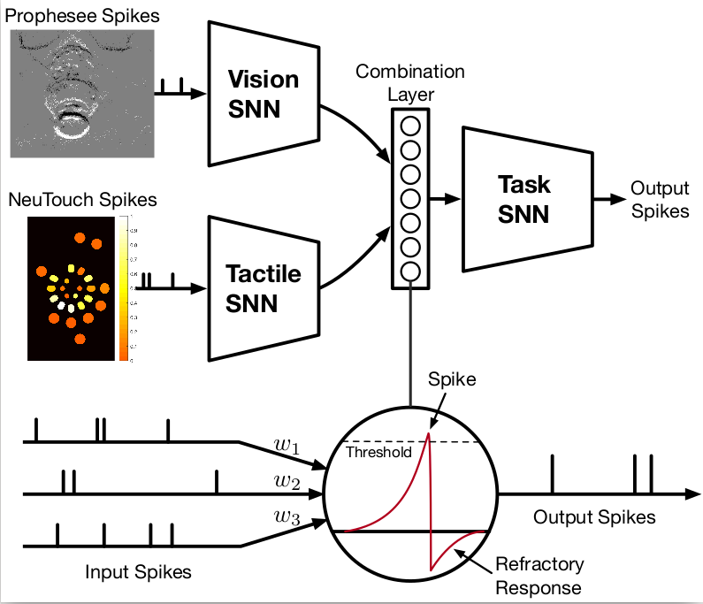

# Event-Driven Visual-Tactile Sensing and Learning for Robots

This work contributes an event-driven visual-tactile perception system,
comprising a novel biologically-inspired tactile sensor and multi-modal
spike-based learning. Our biologically-inspired fingertip tactile sensor,
NeuTouch, scales well with the number of taxels thanks to its event-based
nature. Likewise, our Visual-Tactile Spiking Neural Network (VT-SNN) enables
fast perception when coupled with event sensors. We evaluate our visual-tactile
system (using the NeuTouch and Prophesee event camera) on two robot tasks:
container classification and rotational slip detection. For more details, please go to
our [official web-page](https://clear-nus.github.io/visuotactile/).

<!---  --->

[](https://www.youtube.com/watch?v=zPlrqtjEcUY "")

## Getting Started

### Cloning the Repository

This project also requires a fork of the
[SLAYER](https://github.com/bamsumit/slayerPytorch) framework to learn a Spiking
Neural Network (SNN), which we have included here as a git submodule. To obtain
the full set of dependencies, clone this repository recursively:

``` bash
git clone https://github.com/clear-nus/VT_SNN/ --recursive
```

### Installing Requirements

The requirements for this project that can be installed from PyPI are found in
`requirements.txt`. To install the requirements, run:

``` bash
pip install -r requirements.txt
```

This project also requires a fork of the
[SLAYER](https://github.com/bamsumit/slayerPytorch) framework to learn a Spiking
Neural Network (SNN), which we have included here as a git submodule. To install
this dependency, run:

``` bash
   cd slayerPytorch
   python setup.py install
```

This repository has been tested with the declared sets of dependencies, on
Python 3.6.10.

### Datasets

The datasets are hosted on Google Drive.

1. Slip Dataset ([Lite](https://drive.google.com/file/d/1VBCwDNwjRqRMQ4iPHo8WRh9n5g92nzt6/view?usp=sharing), [Full](https://drive.google.com/file/d/1Nbg5Egob6McVNEXVvXO8OU-SeUXQBVkN/view?usp=sharing))

We also provide helper scripts for headless fetching of the required data. For slip:

``` bash
./fetch_slip.sh
```

The preprocessed data can be also downloaded with parameters specified in the paper:

``` bash
./fetch_slip.sh preprocess
```


### Basic Usage

We provide the scripts for preprocessing the raw event data, and training the
models in the `vtsnn` folder. We provide code for the 3 models presented in our
paper:

1. VT-SNN (Using SLAYER)
2. ANN (MLP-GRU)
3. CNN3D
 
The repository has been carefully crafted to use
[guild.ai](https://github.com/guildai/guildai) to track experiment runs, and its
use is encouraged. However, instructions for running each script (using both
guild and vanilla Python) can be found in each script.

To see all possible operations, run:

``` bash
guild operations
```


For example, to run our VT-SNN tactile-only model on the Container-Weight
classification task, run:

``` bash
guild run vtsnn-tact:train-cw data_dir=/path/to/data
```

Visit the `vtsnn/train_*.py` files for instructions to run with vanilla Python.

## BibTeX

To cite this work, please use:

``` text
@inproceedings{taunyazov20event,
    title={Event-Driven Visual-Tactile Sensing and Learning for Robots}, 
    author={Tasbolat Taunyazoz and Weicong Sng and Hian Hian See and Brian Lim and Jethro Kuan and Abdul Fatir Ansari and Benjamin Tee and Harold Soh},
    year={2020},  
    booktitle = {Proceedings of Robotics: Science and Systems}, 
    year      = {2020}, 
    month     = {July}}
```

## Troubleshooting

if your scripts cannot find the `vtsnn` module, please run in the root directory:

``` 
export PYTHONPATH=.
```
